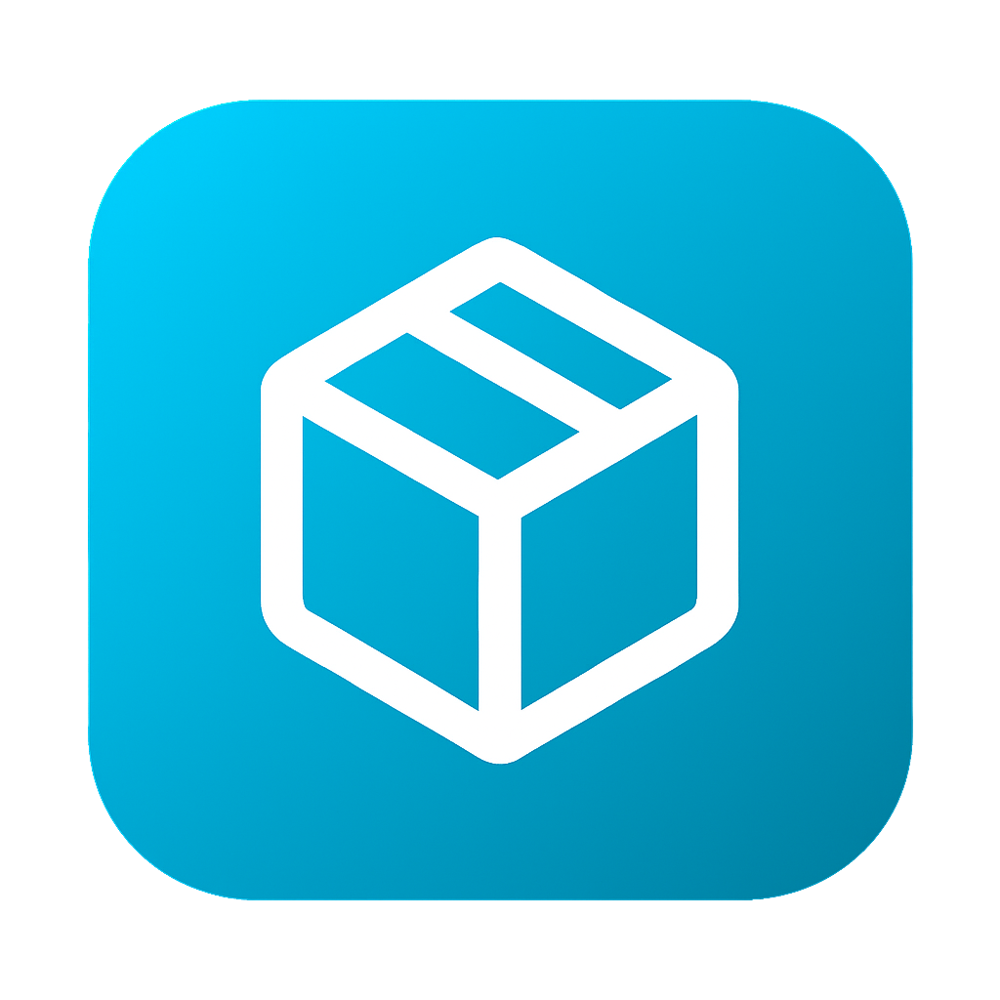

<div align="center">
  
  
  # Bunkerfy
  
  **The Premier Trading Platform for Arc Raiders**
  
  [](https://bunkerfy.top)
  [](https://github.com/oooindefatigable/Bunkerfy.top-qv)
  [](https://nextjs.org)
  [](https://supabase.com)
  [](https://typescriptlang.org)
  [](https://tailwindcss.com)
</div>

---

## About

Bunkerfy is a secure, community-driven trading platform designed specifically for the **Arc Raiders** gaming community. Trade blueprints, items, and resources safely with fellow survivors.

### Key Features

- **Discord Authentication** - Secure login with Discord OAuth integration
- **Real-time Marketplace** - Browse and list items with live updates
- **Secure Trading System** - 30-minute transaction windows with automatic expiration
- **User Reputation System** - Reviews and ratings to build trust
- **Private Messaging** - Direct communication between traders
- **Online Status Indicators** - See who's available to trade in real-time
- **Mobile Responsive** - Trade on any device
- **Email Notifications** - Stay informed about your trades via Resend

---

## Tech Stack

| Category | Technology |
|----------|------------|
| **Framework** | Next.js 16 (App Router) |
| **Language** | TypeScript 5 |
| **Database** | Supabase (PostgreSQL) |
| **Authentication** | Discord OAuth via Supabase Auth |
| **Styling** | Tailwind CSS 4 + shadcn/ui |
| **Email** | Resend |
| **Deployment** | Vercel |

---

## Getting Started

### Prerequisites

- Node.js 18+ 
- npm or pnpm
- Supabase account
- Discord Developer Application

### Installation

1. **Clone the repository**
   ```bash
   git clone https://github.com/oooindefatigable/Bunkerfy.top-qv.git
   cd bunkerfy
   ```

2. **Install dependencies**
   ```bash
   npm install
   # or
   pnpm install
   ```

3. **Set up environment variables**
   
   Create a `.env.local` file in the root directory:
   ```env
   # Supabase
   NEXT_PUBLIC_SUPABASE_URL=your_supabase_url
   NEXT_PUBLIC_SUPABASE_ANON_KEY=your_supabase_anon_key
   SUPABASE_SERVICE_ROLE_KEY=your_service_role_key
   
   # Discord OAuth
   NEXT_PUBLIC_DISCORD_CLIENT_ID=your_discord_client_id
   NEXT_PUBLIC_DISCORD_REDIRECT_URI=http://localhost:3000/auth/callback
   
   # Admin Configuration
   SUPER_ADMIN_USERNAMES=admin_username
   NEXT_PUBLIC_SUPER_ADMIN_USERNAMES=admin_username
   ESCROW_USERNAMES=escrow_username
   NEXT_PUBLIC_ESCROW_USERNAMES=escrow_username
   
   # Email (Resend)
   RESEND_API_KEY=your_resend_api_key
   
   # Discord Webhooks (Optional)
   DISCORD_VISIT_WEBHOOK_URL=your_webhook_url
   DISCORD_NEW_WEBHOOK_URL=your_webhook_url
   DISCORD_TRADES_WEBHOOK_URL=your_webhook_url
   ```

4. **Set up the database**
   
   Run the SQL scripts in the `/scripts` folder in order:
   ```bash
   # Connect to your Supabase SQL editor and run each script
   scripts/001_*.sql
   scripts/002_*.sql
   # ... and so on
   ```

5. **Run the development server**
   ```bash
   npm run dev
   # or
   pnpm dev
   ```

6. Open [http://localhost:3000](http://localhost:3000) in your browser

---

## Project Structure

```
bunkerfy/
├── app/                    # Next.js App Router pages
│   ├── admin/             # Admin dashboard
│   ├── auth/              # Authentication pages
│   ├── dashboard/         # User dashboard
│   │   ├── marketplace/   # Trading marketplace
│   │   ├── messages/      # Private messaging
│   │   ├── my-listings/   # User's listings
│   │   ├── profile/       # User profiles
│   │   └── transactions/  # Transaction management
│   ├── escrow/            # Escrow management
│   └── api/               # API routes
├── components/            # React components
│   ├── admin/            # Admin components
│   ├── layout/           # Layout components (sidebar, nav)
│   ├── marketplace/      # Marketplace components
│   ├── messages/         # Messaging components
│   ├── profile/          # Profile components
│   ├── reviews/          # Review components
│   ├── transactions/     # Transaction components
│   └── ui/               # shadcn/ui components
├── lib/                   # Utilities and configurations
│   ├── email/            # Email templates (Resend)
│   ├── hooks/            # Custom React hooks
│   ├── supabase/         # Supabase client configuration
│   └── utils/            # Helper functions
├── public/               # Static assets
│   └── email-templates/  # HTML email templates
└── scripts/              # Database migration scripts
```

---

## Database Schema

The platform uses the following main tables:

- **profiles** - User profiles with Discord info, reputation, online status
- **items** - Game items catalog (blueprints, resources)
- **listings** - Marketplace listings
- **transactions** - Trade transactions with 30-min timeout
- **messages** - Private messages between users
- **reviews** - User reviews and ratings
- **embark_reports** - User reports for moderation

---

## User Roles

| Role | Permissions |
|------|-------------|
| **User** | Create listings, trade, message, leave reviews |
| **Escrow** | Moderate disputes, ban users/IPs |
| **Super Admin** | Full access, manage items, manage users |

---

## Features in Detail

### Trading System
- Create listings with items you want to offer/receive
- 30-minute transaction timeout for security
- Real-time status updates
- Email notifications on trade events

### Reputation System
- Leave reviews after completed trades
- Star ratings (1-5)
- View trading history and statistics

### Security
- Row Level Security (RLS) on all tables
- Discord OAuth authentication
- Automatic transaction expiration
- Report system for bad actors

---

## Contributing

Contributions are welcome! Please feel free to submit a Pull Request.

1. Fork the repository
2. Create your feature branch (`git checkout -b feature/AmazingFeature`)
3. Commit your changes (`git commit -m 'Add some AmazingFeature'`)
4. Push to the branch (`git push origin feature/AmazingFeature`)
5. Open a Pull Request

---

## Community

- **Website**: [bunkerfy.top](https://bunkerfy.top)
- **Game**: [Arc Raiders](https://www.arcraiders.com/) by Embark Studios

---

## License

This project is licensed under the MIT License - see the [LICENSE](LICENSE) file for details.

---

## Acknowledgments

- [Arc Raiders](https://www.arcraiders.com/) - The game that inspired this platform
- [Embark Studios](https://www.embark-studios.com/) - Game developers
- [shadcn/ui](https://ui.shadcn.com/) - Beautiful UI components
- [Supabase](https://supabase.com/) - Backend infrastructure
- [Vercel](https://vercel.com/) - Hosting platform

---

<div align="center">
  <p>Built with care for the Arc Raiders community</p>
  <p>
    <a href="https://bunkerfy.top">Visit Bunkerfy</a>
    ·
    <a href="https://github.com/oooindefatigable/Bunkerfy.top-qv/issues">Report Bug</a>
    ·
    <a href="https://github.com/oooindefatigable/Bunkerfy.top-qv/issues">Request Feature</a>
  </p>
</div>
